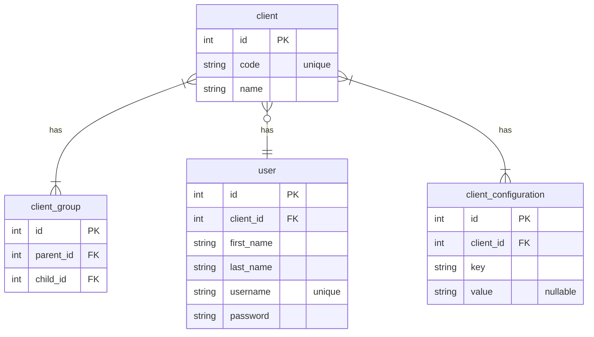

nesterprise

## Description

A thin fork over nestjs that is intended to satisfy a fairly specific set of goals:
- a uniform set of API endpoints for clients to retrieve model data
- clients can have inheritance
  - e.g. client A, could have 2x children - client B and client C
  - client A should therefore be able to query the data of all of its children
  - client B and client C should only be able to query their own data, not each others
- clients are identified by an API key and a HTTP header
- has DTOs that return a subset of the underlying data models
- has DTOs that may vary between clients

The theoretical data model leading to the above goals could be something like:


## Installation

```bash
$ npm install
```

## Running the app

```bash
# development
$ npm run start

# watch mode
$ npm run start:dev

# production mode
$ npm run start:prod
```

## Test

```bash
# unit tests
$ npm run test

# e2e tests
$ npm run test:e2e

# test coverage
$ npm run test:cov
```
